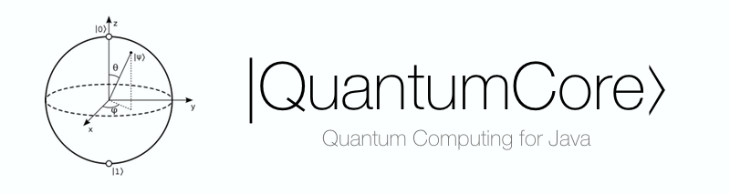

A quantum computing library for Java.

The library is modeled after the paper ["Emulating Circuit-Based and Measurement-Based Quantum Computation"](https://www.doc.ic.ac.uk/teaching/distinguished-projects/2010/s.allcock.pdf).

## Features
* Quantum simulator
* Entangled Qubit registers
* Measurement
* Quantum Gates
	* Hadamard
	* Pauli X, Y and Z
	* SqrtNOT
	* CNOT
	* Swap
	* Toffoli (CCNOT gate)
	* Fredkin (CSwap gate)
